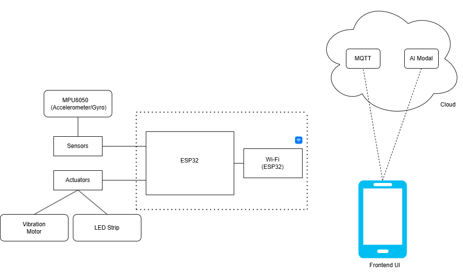
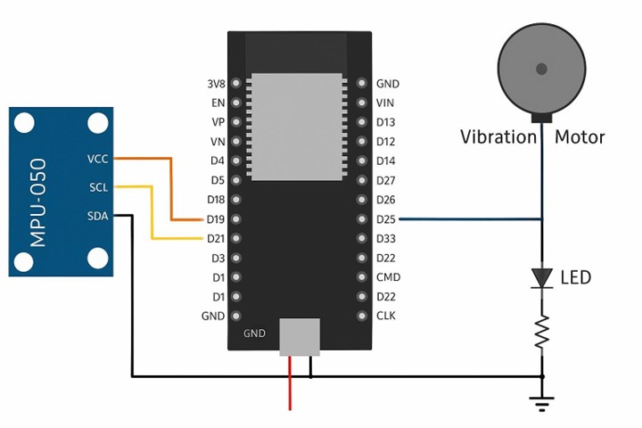
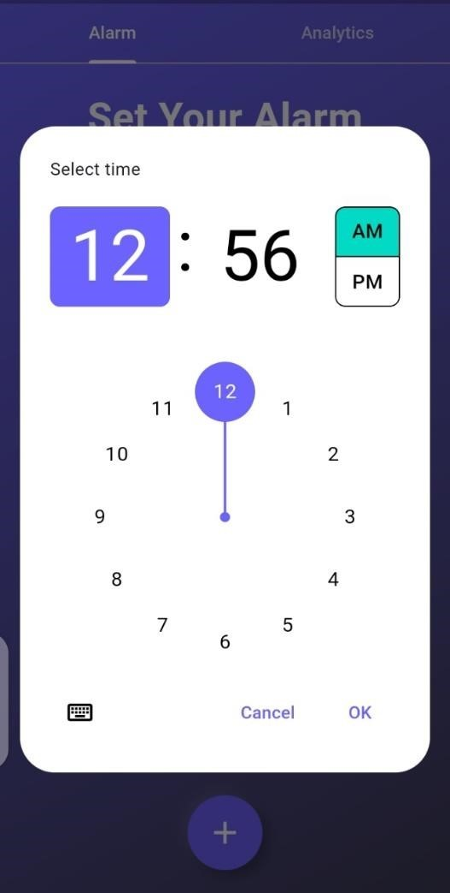

# 🌙 Sleep Sync – Smart Sleep Tracker & Wake-Up System

**Sleep Sync** is an intelligent IoT-based sleep monitoring and smart alarm system designed to enhance your sleep quality. It uses motion tracking via MPU6050, cloud-based AI prediction, and a smart alarm feature that wakes you during light sleep.
---
```bash
SleepSync/
│
├── arduino/        # Code for ESP32/MPU6050 for motion tracking
├── server/         # Flask + MQTT backend with ML model for sleep classification
├── mobileapp/      # Flutter-based mobile app with alarm, analytics, and UI
├── assets/         # Images, diagrams, model files, and visual content
└── README.md       # Project documentation
```


---

## 🎯 1. Project Aims

- Monitor sleep patterns using real-time accelerometer data.
- Classify sleep phases using a machine learning model hosted on the cloud.
- Communicate data using MQTT protocol for low-latency real-time updates.
- Use a smart alarm to wake the user at the lightest sleep phase within a custom window.

---

## 🧠 2. System Architecture


---

## 🔧 3.Sensor Block Diagram
 <!-- Replace with actual image -->

---

## 📡 4. MQTT Topics Overview

| Topic             | Type         | Description                                                                 |
|------------------|--------------|-----------------------------------------------------------------------------|
| `setalarm/#`      | Subscribed   | Sets wake-up window. Format: `YYYY-MM-DD_HH:MM,YYYY-MM-DD_HH:MM`           |
| `acc/data`        | Subscribed   | Streams accelerometer data (`x`, `y`, `z`)                                  |
| `wakeUp/`         | Pub/Sub      | Triggers wake-up when light sleep is detected or window ends               |
| `sleeptrackON/`   | Pub/Sub      | Starts/stops sleep tracking (`1` for start, `0` for stop)                  |
| `sleepdata/`      | Published    | Publishes JSON of recorded sleep sessions after each night                 |

---

## 🤖 5. Cloud AI Model
- **Model Type:** Random Forest Classifier  
- **Feature Extraction:**  
  - Mean, Std, Min, Max, Median, Range  
  - Magnitude and composite features (Total: 20+)  
- **Preprocessing:** MinMaxScaler  
- **Training Method:** GridSearchCV  
- **Best Parameters:**  
  - `n_estimators=200`  
  - `max_depth=20`  
  - `min_samples_split=2`  
- **Performance:**  
  - Accuracy: ~80%  
  - Evaluation Metrics: Accuracy, F1-score, Confusion Matrix  
- **Deployment:**  
  - `.pkl` model file loaded into Flask server  
  - Real-time prediction via HTTP API
 <!-- Replace with actual image -->

---

## 📱 6. Mobile App – User Guide

### 🔔 Set Smart Alarm

- Navigate to the **Set Alarm** tab.
- Tap the ➕ button to create a new alarm.
- Enter:
  - **Start Time** – earliest time you're okay to wake up
  - **End Time** – latest time to wake up
- Save alarm → sent via MQTT to ESP32.

### 📈 View Sleep Data

- Visit the **Sleep Logs** tab.
- Review graphs: Movement, Predicted Sleep Phases, Wake-up moments.

### 🔊 Wake-up Notification

- If light sleep is detected in alarm window → alarm is triggered.
- If no light sleep phase is detected → alarm rings at `endTime`.

---

## 📷 7. Sample Screenshots

| Set Alarm Screen | Clock | Splash Screen |
|------------------|--------------|-----------------------|
|  |  |  |

---

## 🛠️ Tech Stack

- **Hardware:** ESP32, MPU6050 Accelerometer
- **IoT Communication:** MQTT (Mosquitto)
- **Backend:** Python Flask (API + Model Hosting)
- **ML Framework:** scikit-learn
- **Mobile App:** Flutter
- **Database:** Firebase Firestore (optional)

---

## 🚀 Future Enhancements

- Add heart rate sensor integration
- User-based personalization of alarm logic
- Sleep goal tracking and recommendations
- Integration with wearable devices

---

## 🧑‍💻 Contributors

- **Tayyab Anees** – Embedded + AI Model + MQTT + Flask Backend 
- **Abdul Ahad** – Flutter + Firebase
- 
---

## 📄 License

This project is licensed under the MIT License. See [LICENSE](LICENSE) for more information.


